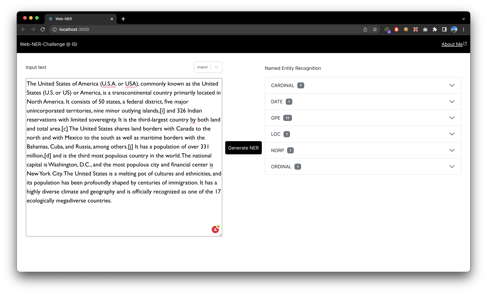
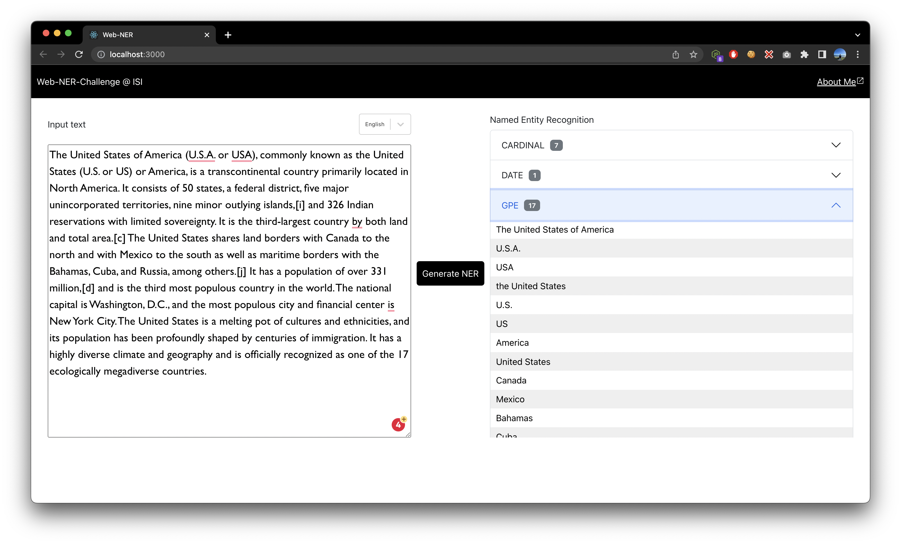
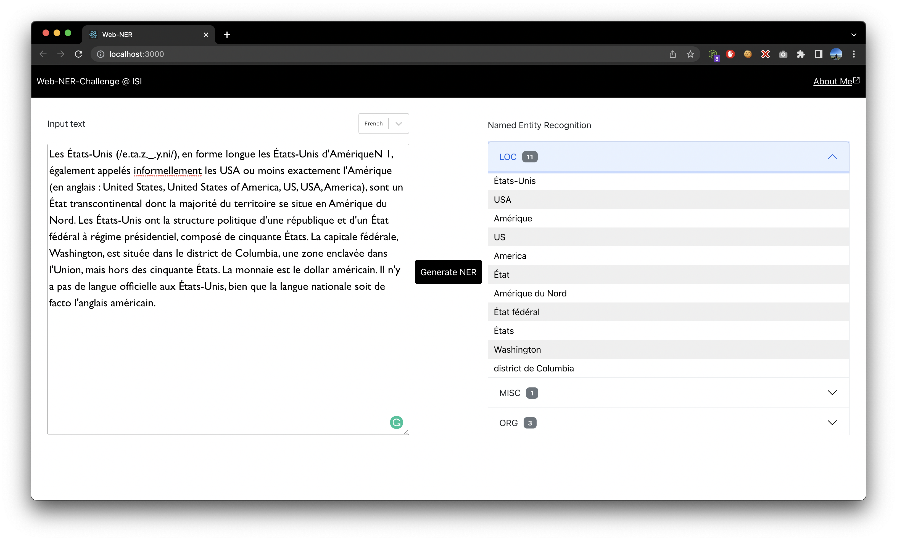
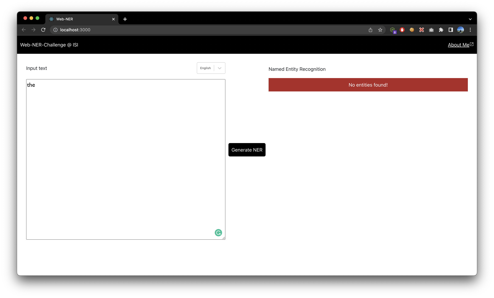

# Web-based named entity recognition

Originally developed in 2021 by Joe Cummings (@joecummings) and Jacob Lichtefeld (@lichtefeld). Updated in August 2022.

### Background

[Named entity recognition](https://en.wikipedia.org/wiki/Named-entity_recognition) (NER) is a very important and long-standing goal of the NLP community. In it, we attempt to identify and categorize "entities" from text so that we can use them for downstream processing such as argument attachment or [event extraction](http://ceur-ws.org/Vol-779/derive2011_submission_1.pdf).

If you've never worked with NER before [SpaCy's EntityRecognizer](https://spacy.io/api/entityrecognizer) may be a place to start. This project includes SpaCy in the python requirements by default.

## Task: Build a web application that can take in text and return named entities.

```
Text: The pilot, John Doe, flew over the United States in his airplane.

Named entities: John Doe (PERSON), the United States (GPE)
```

### Specifications:
* Text will be no longer than 500 words.
* Required named entity types are PERSON, GPE (Geopolitical Entity), LOC (Location), ORG (Organization) - you can add more if you choose
* If no named entities are found, return a "No entities found" message.

### Templates:
Because we don't aim to test you on project setup, we have provided templates that you may choose to use if you wish. For the frontend, we've given you templates in [`Vue.js`](https://vuejs.org/), [`React.js`](https://reactjs.org/), and [`Angular`](https://angular.io/). For the backend, we have provided a template in [`Flask`](https://flask.palletsprojects.com/en/2.0.x/).
1. Make sure you have `Node.js` and `npm` installed.
   * In case you don't have Node.js or npm installed, refer to the NodeSource blog posts [Installing Node.js Tutorial: Using nvm](https://nodesource.com/blog/installing-node-js-tutorial-using-nvm-on-mac-os-x-and-ubuntu/) (macOS and Ubuntu) or [Installing Node.js Tutorial: Windows](https://nodesource.com/blog/installing-nodejs-tutorial-windows/) (Windows) for instructions.
2. We also recommend setting up a virtual environment for the Python dependencies. A good one is [Miniconda](https://docs.conda.io/en/latest/miniconda.html), which you can then use in a manner similar to the following code snippet:
  ```
  conda create --name web-ner python=3.8
  ```
3. Run `make install FRONTEND=react-frontend BACKEND=flask-backend`
4. Run `make start FRONTEND=react-frontend BACKEND=flask-backend`

### Judging criteria:
* **Code quality** - We want to know that you are capable of writing production-level code involving machine learning material.
* **Usability** - The interface should be intuitive to use for the reviewer.
* **Accuracy of model** - The model you choose to use should be able to cover the very basics, like recognizing `the United States` as a GPE. We just want to know that whatever model you choose or implement works.
* **Creativity** - This is a catch-all category for whatever else you want to incorporate to show off your skills. Some examples could be implementing more entity types or other linguistic features, creating a more visually appealing interface, creating an option to use a different language, or adding better error handling. This is your time to shine.

### Screenshots:

English Results Collapsed


English Results


French Results


No Results


> If you have any questions/comments while working on this, please reach out to your contact at ISI.

> Reach out to me on https://linktr.ee/vishalvasnani and vasnani@usc.edu